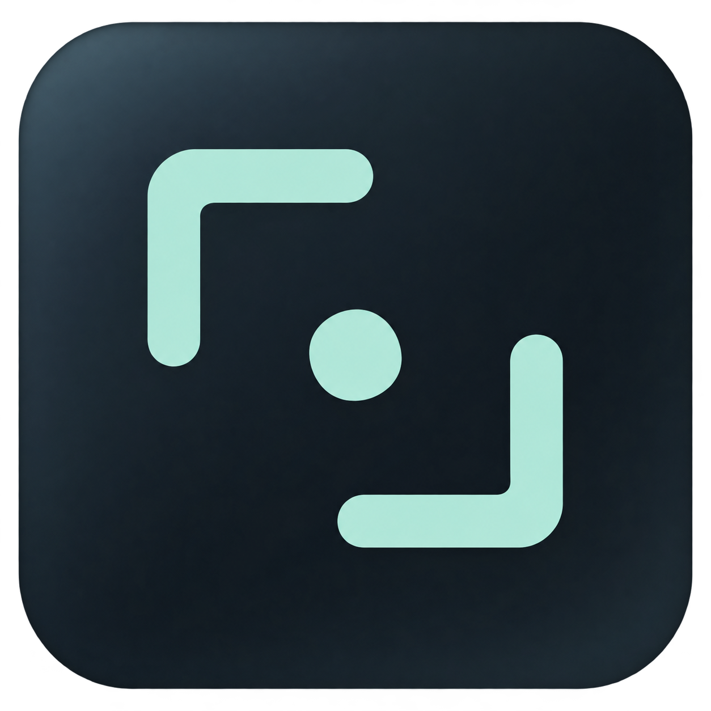
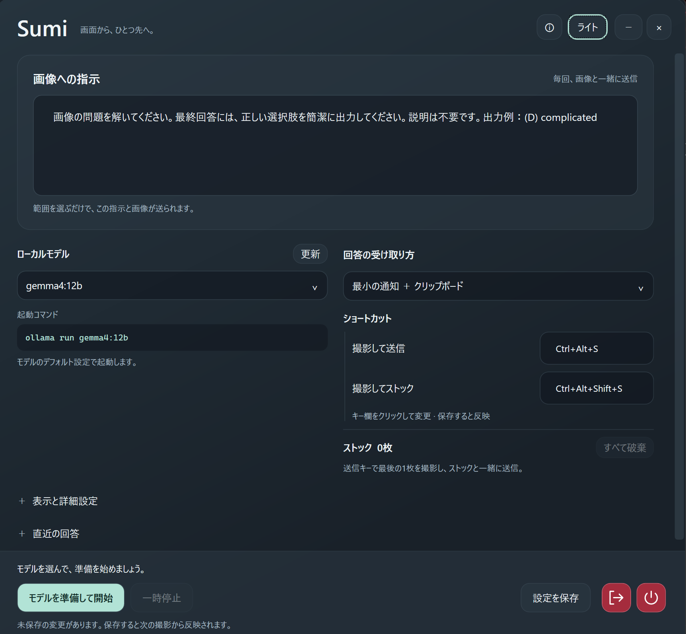
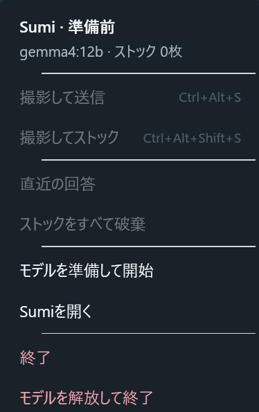

  

# Sumi

画面の好きな範囲を撮影し、あらかじめ設定した指示と一緒にローカルLLMへ送るWindowsアプリです。回答は小型パネル、目立たない最小通知、クリップボードで受け取れます。複数の画像をためて、まとめて質問することもできます。

[ダウンロード](https://github.com/Lye-0/Sumi/releases) · [開発する](docs/development.md) · [リリース手順](docs/releases.md)

  

## はじめに

必要なものは、**Windows 11・Ollama・画像入力に対応したローカルモデル**です。動作検証には `gemma4:12b` を使用しています。

1. Ollamaを起動し、使いたいモデルをあらかじめ導入します。Sumiからモデルのダウンロードは行いません。
2. [Releases](https://github.com/Lye-0/Sumi/releases)から、ご使用のPCに合うZIPをダウンロードします。
   - Intel／AMDのWindows PC：`win-x64.zip`
   - Windows on ArmのPC：`win-arm64.zip`
3. ZIPを任意の場所へ**フォルダーごと展開**し、`Sumi.exe` を起動します。

.NETランタイムは配布ZIPに同梱しています。別途インストールする必要はありません。同梱のDLLなどは削除せず、フォルダー一式で使用してください。

## まずは1枚、撮影して送信

1. **「画像への指示」**に、画像についてしてほしいことを入力します。
2. **ローカルモデル**と**回答の受け取り方**を選びます。
3. 起動コマンドを確認し、**「モデルを準備して開始」**を押します。
4. 「待機中」になったら、**Ctrl＋Alt＋S**を押します。
5. 読み取ってほしい範囲をドラッグします。マウスを離すと、画像と指示が自動で送信されます。

撮影を取り消すときは、範囲選択中に **Esc** または **右クリック**。設定画面は **×で閉じても常駐を続ける**ので、撮影のたびに開き直す必要はありません。PC起動時の自動起動登録は行いません。

画像への指示の例

**内容を要約する**

> 画像の内容を日本語で3行以内に要約してください。

**文章を翻訳する**

> 画像内の英文を自然な日本語に翻訳してください。翻訳文のみを出力してください。

**選択問題に答える**

> 画像の問題を解いてください。最終回答には、正しい選択肢の記号と語句を「(記号) 語句」の形式で1行に出力してください。説明は不要です。

指示は毎回、撮影画像と一緒に送られます。変更後は「設定を保存」を押してください。回答内容や速度は使用するモデルと画像によって変わります。

## 複数の画像をまとめて送る

| ショートカット（初期設定） | 動作 |
| --- | --- |
| **Ctrl＋Alt＋Shift＋S** | 範囲を撮影し、送信せずにストックする |
| **Ctrl＋Alt＋S** | 最後の1枚を撮影し、ストックした画像と一緒に送信する |

例えば、最初の2枚をストックしてから送信キーで最後の1枚を撮影すると、**計3枚を撮影順にまとめて送信**します。ストックがなければ、最後に撮影した1枚だけを送ります。

ストックの確認・取り消し・上限

- 枚数は設定画面やトレイメニューで確認できます。「すべて破棄」で空にできます。
- 回答の取得に成功するとストックは空になります。
- 失敗・キャンセル・一時停止では、ストック済みの画像を保持します。送信キーを再び押すと、もう一度最後の1枚を撮影します。
- 送信時に撮った最後の1枚はストックには追加されません。必要なら次回あらためて撮影してください。
- ストックは最大20枚・PNG合計128MB。送信時の最後の1枚を含めると最大21枚です。実際に扱える枚数はモデルやPCのメモリにも左右されます。
- ストックはメモリ内だけに保持し、Sumiを終了すると消えます。

## 回答の受け取り方を選ぶ

| 設定 | 回答の表示 | 自動コピー |
| --- | --- | --- |
| 小型パネル | 通常サイズのパネル。コピー・直近の回答・閉じるボタン付き | なし |
| 最小の通知 | 回答と控えめな思考アコーディオンだけの小さな表示 | なし |
| クリップボード | 通常の回答パネルを開かずに取得 | あり |
| 小型パネル ＋ クリップボード | 小型パネル | あり |
| 最小の通知 ＋ クリップボード | 最小の通知 | あり |

自動コピーされた内容は、貼り付けたい場所で **Ctrl＋V** を押して利用できます。直近の回答は、設定画面やトレイメニューからも確認できます。

最小の通知・表示時間・思考内容について

**最小の通知**は、回答が1行なら1行分、2行なら2行分の高さで表示します。3行以上は最大2行の高さに収め、スクロールして続きを読めます。思考を展開した場合も、思考本文は最大2行でスクロールできます。右クリックで閉じられます。

通常の通知は設定した秒数で閉じます。マウスを重ねている間、思考を展開している間、エラー表示中は自動で閉じません。

**「モデルの思考内容も表示」**をオンにすると、モデルが出力した思考をアコーディオンで確認できます。初期設定はオフです。思考を行うかどうかなど、モデル自体の設定は変更しません。回答本文が取得できなかった場合でも、取得済みの思考は表示できます。

**クリップボードに入る内容**は、回答が得られた場合は回答のみです。自動再試行後も回答本文がなく、思考だけが得られた場合は、最後に取得した思考内容をコピーします。これは思考の表示設定がオフでも有効です。思考も空の場合や、手動キャンセル・時間切れ・CLIエラーでは上書きしません。

## 設定変更・一時停止・終了

設定を変えたら **「設定を保存」**を押すと、次の撮影から反映されます。モデルを変更するときは、一度「一時停止」してから選び直し、「モデルを準備して開始」を押してください。

| 操作 | 動作 |
| --- | --- |
| 右上の **×** | 設定画面を閉じてトレイへ格納。常駐は続ける |
| **一時停止** | 撮影ショートカットを停止。再開可能 |
| **終了**（出口のアイコン） | Sumiを終了。モデルの保持はOllamaに任せる |
| **モデルを解放して終了**（電源のアイコン） | 使用したモデルをメモリから解放してSumiを終了 |

「モデルを解放して終了」でもOllama本体は終了しません。同じモデルを別のアプリが利用している場合、その利用にも解放が影響します。

通知領域（トレイ）から操作する

Windows右下の通知領域にあるSumiアイコンを、**左クリック**すると設定画面が開きます。見当たらない場合は、通知領域の隠れているアイコンも確認してください。

**右クリック**では、状態・モデル・ストック枚数を確認し、撮影、直近の回答、一時停止／再開、終了などを操作できます。使えない項目は薄く表示されます。配色はSumiのライト／ダーク設定に追従します。

ショートカット・表示・画像保存の設定

| 項目 | 設定方法 |
| --- | --- |
| ショートカット | キー欄をクリックし、使いたい組み合わせを実際に押す。Ctrl／Alt／Shiftと英数字に対応。送信用とストック用には別の組み合わせを指定 |
| ライト／ダーク | 画面右上のボタンで切り替え。「設定を保存」で次回も復元 |
| 通知の表示時間 | 「表示と詳細設定」の「パネルの表示秒数」で3～120秒を指定 |
| 回答の待機時間 | 「回答の待機上限・秒」で30～1800秒を指定 |
| 思考の表示 | 「モデルの思考内容も表示」をオンにする |
| 画像の保存 | 「撮影画像をファイルに保存」をオンにし、「参照…」で保存先を選択。空欄ならピクチャ内のSumiフォルダー |
| 画像のコピー | 「撮影画像もクリップボードにコピー」をオンにする |
| Ollama実行ファイル | 通常は空欄で自動検出。見つからない場合は「参照…」からollama.exeを指定 |

画像の保存・コピーは送信時に行います。複数画像の場合は最後の画像がクリップボードに入り、回答の自動コピーも有効なら回答取得後に置き換わります。

保存場所・アプリの移動・データの扱い

- 設定ファイルは通常 **`%LOCALAPPDATA%\Sumi\settings.json`** に保存します。
- 本体や関連ファイルの場所は、画面右上の **ⓘ** から確認できます。
- 本体を移すときはSumiを終了し、配布フォルダー全体を移動します。設定は本体の設置先と独立しています。
- 画像保存を有効にしていなければ、送信に使った一時PNGは処理終了時に削除します。
- 回答・思考・ストックはメモリ内で扱い、履歴ファイルとして保存しません。クリップボードへコピーした内容や、明示的に保存した画像は別です。
- SumiはローカルのOllama CLIと連携します。現在、クラウドモデルには対応していません。

うまく動かないとき

**モデルが表示されない・準備に失敗する**

Ollamaが起動しているか、モデルを導入済みか確認し、モデル一覧の「更新」を押してください。画像入力に対応したモデルが必要です。Ollamaが見つからない場合は、詳細設定で実行ファイルを指定できます。

**ショートカットを登録できない**

他のアプリと競合している可能性があります。Sumiのキー欄で別の組み合わせを指定し、保存してください。

**思考だけが表示され、回答が出ない**

回答本文が空の場合、Sumiは同じ画像と指示で1回だけ自動再試行します。改善しなければ、指示に出力形式を明記するか、文字が読みやすい範囲で撮り直してください。思考表示をオンにすると、取得済みの思考も確認できます。

**回答が時間切れになる**

待機上限を延ばすか、送る画像の枚数・範囲を減らしてください。モデルを長時間使わなかった後は、読み込み直しで時間がかかることもあります。

**通知が自動で消えない**

思考の展開中やエラー時は、確認できるよう表示を維持します。最小通知は右クリック、通常の小型パネルは「閉じる」で閉じられます。

## 開発・ライセンス

ビルド・テスト・実装上の補足は [開発ガイド](docs/development.md)、タグからの公開方法は [リリース手順](docs/releases.md) を参照してください。

Sumiは **GPL-3.0-only** で公開しています。全文は [LICENSE](LICENSE) を参照してください。Ollamaと各モデルのライセンスは、それぞれの配布元に従います。
